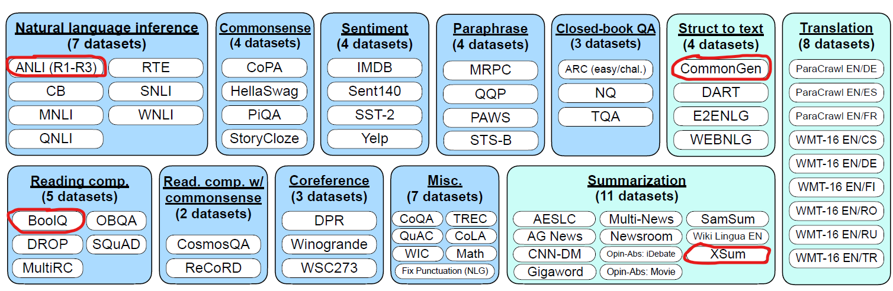

# Fine-Tuning GPT-2 on Multi-Task Instructions

Fine-tuning GPT-2 on the FLANv1 dataset.

_Tasks chosen from the FLANv1 dataset (muffin)._

For now, we will only focus on fours tasks and later expand to the whole dataset.

| Model                                   |  ANLI (acc) | BoolQ (acc) | CommonGen (rg-1) | XSum (rg-LSum) |
|-----------------------------------------|-------------|-------------|------------------|----------------|
| google/flan-t5-small                    | 0.008       | 0.2         | 0.275            | 0.175          |
| OscarNav/gpt2-multitask (medium)        | 0.33        | 0.588       | 0.253            | 0.141          |
| google/flan-t5-base                     | 0.216       | 0.534       | 0.307            | 0.217          |
| google/flan-t5-large                    | 0.086       | 0.378       | 0.324            | 0.252          |
| google/flan-t5-xl                       | 0.686       | 0.796       | 0.345            | 0.277          |
| google/flan-t5-xxl (quantized)          | 0.568       | 0.784       | 0.352            | 0.277          |
| google/flan-t5-small-distilled-xl       | 0.32        | 0.564       | 0.120            | 0.150          |
| OscarNav/flan-gpt2-distill-test (small) | 0.078       | 0.096       | 0.203            | 0.096          |

For the T5-FLAN models, we should have expected to see a higher score for classification tasks. However we evaluated all models with the original dataset labels instead of the ones they were trained. For example, T5-FLAN trained on BoolQ using "yes" and "no" as targets instead of the original True and False. See the [evaluation notebook](https://colab.research.google.com/drive/1tfUkfX2p_CL7X7VqdHcrZxhlZErpMX3L) for more examples.

We cannot distill GPT-2 using FLAN-T5 as a teacher via KL-divergence (for example) because they have different tokenizer and vocabulary. Instead, we implemented [Universal Logit Distillation](https://arxiv.org/abs/2402.12030)