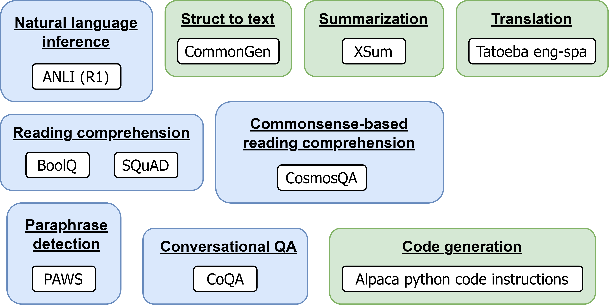

# Distilling GPT-2 on Multi-Task Instructions

In this project, we combine Kowledge Distillation (KD) alongside with instruction-tuning for training smaller language models (such as GPT-2) to follow natural multi-task prompts. We argue that models with less than a billion parameters are also capable to understand natural language prompts and generalize across 10 different tasks.

We cannot distill GPT-2 using FLAN-T5 as a teacher via KL-divergence (for example) because they have different tokenizer and vocabulary. Instead, we implemented [Universal Logit Distillation](https://arxiv.org/abs/2402.12030).

Our method demonstrated better performance compared with vanilla fine-tuning.

<figure>

<figcaption><i>Performance on our evaluation benchmark. The GPT-2 KD model shows better generalization than the FT version.</i></figcaption>
</figure>

## Tasks collection

For the training data, we used a custom subset of the Muffin collection (i.e. [FLAN_v1](https://arxiv.org/abs/2109.01652) dataset) in addition to more datasets. In this multi-task setting, we carefully selected a task collection composed of 10 Natural Language Understanding and Natural Language Generation datasets.

<figure>

<figcaption><i>Tasks collection used to finetune/distill GPT-2.</i></figcaption>
</figure>

## Results

For now, we only focus on benchmarking with train dataset and comparing with teacher's family models.

| Model             | Params (M) | BoolQ Acc. | SQuAD F1 | SAMSum R-L | SAMSum BS | ANLI Acc. | PAWS Acc. | XSum R-L | XSum BS | CommonGen R-L | CommonGen Cov. | CosmosQA Acc. |
|------------------|------------|------------|----------|-------------|-----------|-----------|-----------|-----------|----------|----------------|------------------|----------------|
| **Train**         |            |            |          |             |           |           |           |           |          |                |                  |                |
| FLAN-T5-Small     | 80         | 42.5       | 78.0     | 29.6        | 89.5      | 32.1      | 52.6      | 18.1      | 87.1     | 27.4           | 69.6             | 40.0           |
| FLAN-T5-Base      | 250        | 72.3       | 89.9     | 34.8        | 90.6      | 35.1      | 91.5      | 22.3      | 88.6     | 34.1           | 86.8             | 60.1           |
| FLAN-T5-Large     | 780        | 75.1       | 90.8     | 38.2        | 91.5      | 34.3      | 97.1      | 26.1      | 89.7     | 38.6           | 92.4             | 83.3           |
| FLAN-T5-XL        | 3,000      | 86.0       | 91.9     | 40.0        | 91.9      | 90.0      | 96.0      | 26.9      | 90.1     | 37.9           | 96.0             | 90.0           |
| FLAN-T5-XXL       | 11,000     | 88.0       | 92.6     | 39.9        | 91.7      | 92.0      | 94.0      | 27.8      | 90.5     | 39.2           | 95.3             | 87.0           |
| GPT-2-Med-FT      | 345        | 77.8       | 60.4     | 31.9        | 88.5      | 42.0      | 66.0      | **19.0**  | **75.9** | 31.5           | 74.6             | **39.0**       |
| GPT-2-Med-KD      | 345        | **77.9**   | **72.8** | **39.0**    | **90.0**  | **46.0**  | **78.0**  | 18.1      | 72.5     | **42.0**        | **94.0**          | 35.0           |
| Pythia-410M-FT    | 410        | **82.0**   | 67.6     | **30.0**    | **89.9**  | 48.0      | **74.0**  | 14.8      | **75.2** | **41.0**        | 87.3             | 37.0           |
| Pythia-410M-KD    | 410        | 77.9       | **67.7** | 22.5        | 84.0      | **60.0**  | 56.0      | **17.2**  | 73.0     | 40.9           | **90.6**          | **49.0**       |
| SmolLM-360M-FT    | 360        | 74.0       | **85.3** | **38.4**    | **89.8**  | 46.0      | 66.0      | 16.5      | 69.5     | 38.5           | **93.3**          | 31.0           |
| SmolLM-360M-KD    | 360        | **77.9**   | 65.7     | 17.6        | 64.0      | **56.0**  | **68.0**  | **17.1**  | **73.1** | **43.1**        | 92.0             | **32.0**       |
| **Test**          |            |            |          |             |           |           |           |           |          |                |                  |                |
| FLAN-T5-XL        | 3,000      | 80.0       | 93.9     | 38.0        | 91.4      | 74.0      | 90.0      | 26.9      | 90.3     | 32.8           | 90.6             | 84.0           |
| GPT-2-Med-FT      | 345        | 78.0       | 67.2     | 23.6        | 88.6      | 24.0      | 62.0      | 8.8       | **79.2** | 23.5           | 64.0             | **34.0**       |
| GPT-2-Med-KD      | 345        | **78.4**   | **73.5** | **30.4**    | **90.0**  | **31.3**  | **62.7**  | **8.9**   | 76.1     | **31.0**        | **81.0**          | 33.3           |
| Pythia-410M-FT    | 410        | 76.0       | 56.8     | 31.7        | **90.3**  | **42.0**  | 38.0      | 4.5       | 76.3     | **30.8**        | **78.0**          | **32.0**       |
| Pythia-410M-KD    | 410        | **78.0**   | **63.4** | **32.0**    | 90.1      | 30        | **57.9**  | **8.12**  | **81.2** | 29.9           | 77.3             | 30.0           |
| SmolLM-360M-FT    | 360        | 68.0       | 54.9     | 31.5        | 90.4      | 36.0      | **62.0**  | 6.1       | 77.4     | 32.0           | 81.9             | 30.0           |
| SmolLM-360M-KD    | 360        | **78.0**   | **56.6** | **38.6**    | **93.1**  | **36.9**  | 60.0      | **10.3**  | **79.0** | **33.6**        | **95.3**          | **33.0**       |

We compared results using our evaluation benchmarks, which consists of the dev (validation) and test split of the 8 white datasets. We used 200 examples for XSum and CoQA and 500 for the rest. We used rank classification to compute accuracy on ANLI, BoolQ, PAWS and CosmosQA. Only a single template was used for evaluation since we wanted to avoid instructions that could turn a task from NLU to NLG. The FLAN-T5-XXL was the larger model evaluated for his experiments but because it was validated using the same hardware that was used for training, we used 4-bit quantization to fit its weights into memory but loose some accuracy in the process. For the ANLI and PAWS datasets, our KD outperforms its teacher, presumably because the teacher was in disadvantage as it was trained with different ground-truth labels. This highlight the need to train with larger or finetune teachers to achieve better performance.

See the [evaluation notebook](https://colab.research.google.com/drive/1tfUkfX2p_CL7X7VqdHcrZxhlZErpMX3L) for more examples.

## Generalization on unseen tasks

For very few examples we actually saw some zero-shot behavior. 

<figure>

<figcaption><i>Generalization on unseen tasks.</i></figcaption>
</figure>

We argue that the model was able to generate a dialogue even though it was never explicitly trained with such task. Also in the QA, the model didn't return a translation or another question, but in return it responded properly.

